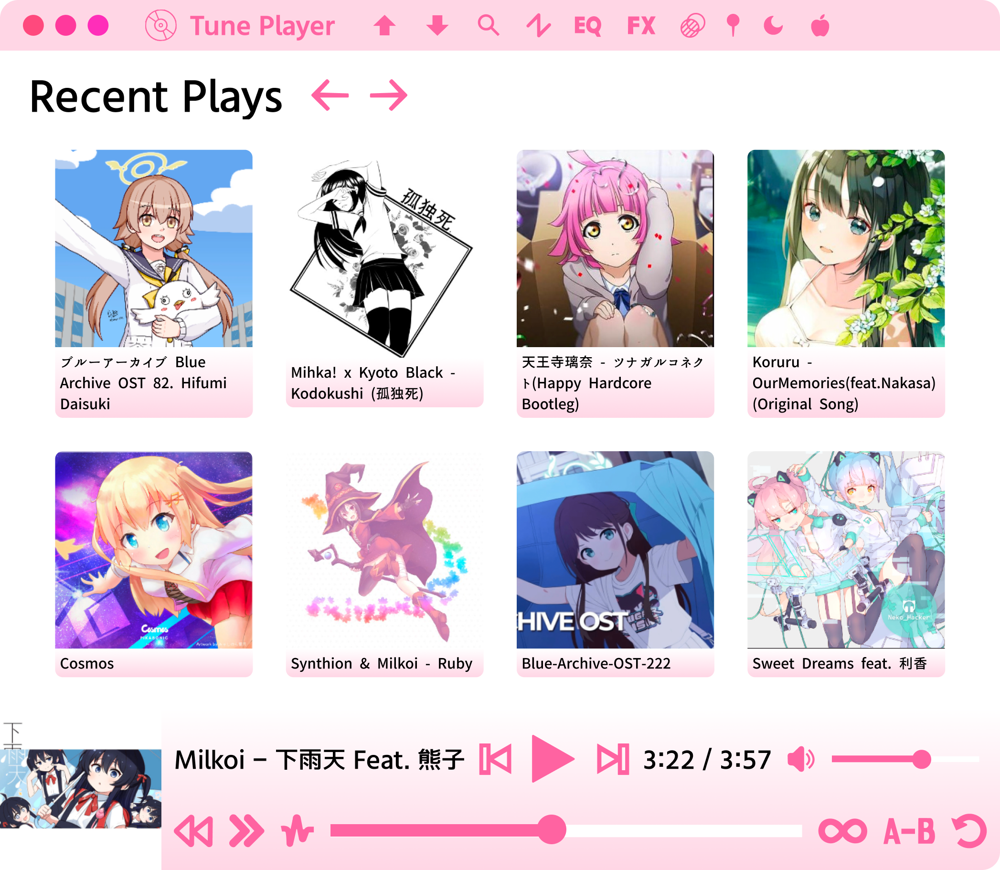

## Tune Player
   


This is a simple music player app.

### Features:
- Play audio (MP3, WAV) and MIDI files
- Adjust the volume of the audio
- Reverse audio in real-time
- Time stretching in real-time (can either preserve or affect the pitch)
- Pitch shifting in real-time (only if time-stretch is set to not affect the pitch)
- Looping from point A to point B
- Support for local files, YouTube videos, and Soundcloud tracks
- Render and download audio/midi with effects
- Keeps a record of recent plays
- Play previous and next tracks (from your file system)
- Customize the controls of the MIDI synthesizer

### Keyboard Shortcuts
- Space: Play/Pause
- Left Arrow: Rewind
- Right Arrow: Fast forward
- Up Arrow: Increase volume
- Down Arrow: Decrease volume
- Mouse Wheel: Increase/decrease volume
- Ctrl O: Upload file
- Ctrl S: Download file
- Drag and drop: Upload file

### Design

Our design is available here: https://www.figma.com/design/CTEs64SQjKg7M1SXzGx0Kh/Tune-Player

*New design is wip

### Installation

Download the latest installer from the [releases](https://github.com/Moebytes/Music-Player/releases) tab. Updates can be installed automatically.

### MacOS

On MacOS unsigned applications won't open, run this to remove the quarantine flag.
```
xattr -d com.apple.quarantine "/Applications/Music Player.app"
```

### Bugs and Requests

Open an issue on my GitHub repository.

### Also See

- [Photo Viewer](https://github.com/Moebytes/Photo-Viewer)
- [Video Player](https://github.com/Moebytes/Video-Player)


