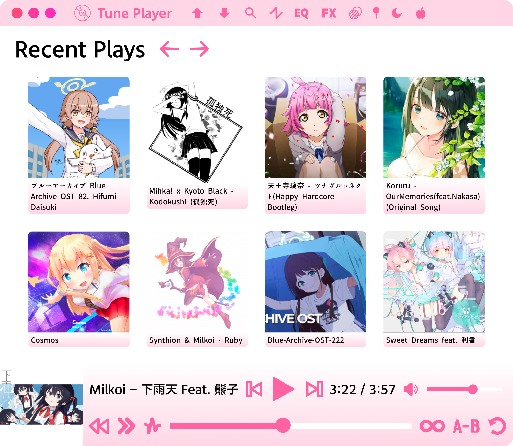

## Tune Player
   

A cute music player!

### Features:
- Play audio (MP3, WAV, OGG, FLAC) and MIDI files
- Reverse playback
- Speed adjustment (can either preserve or affect the pitch)
- Pitch shifting (and LFO pitch effect)
- Looping from point A to point B
- Audio filters and effects (lowpass, highpass, reverb, delay, bitcrush)
- Render and download audio/midi with effects
- Stores your recent plays for easy access
- Customize the controls of the MIDI synthesizer

### Keyboard Shortcuts
- Space: Play/Pause
- Left Arrow: Rewind
- Right Arrow: Fast forward
- Up Arrow: Increase volume
- Down Arrow: Decrease volume
- Mouse Wheel: Increase/decrease volume
- Ctrl O: Upload file
- Ctrl S: Download file
- Drag and drop: Upload file

### Design

Our design is available here: https://www.figma.com/design/CTEs64SQjKg7M1SXzGx0Kh/Tune-Player

### Installation

Download from [releases](https://github.com/Moebytes/Tune-Player/releases).

### See Also

- [Pic Display](https://github.com/Moebytes/Pic-Display)
- [Frame Player](https://github.com/Moebytes/Frame-Player)

